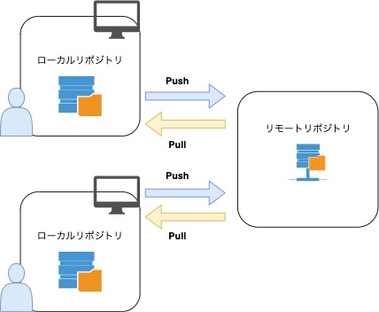
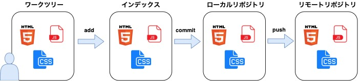

## Gitとは？

分散型バージョン管理システム。

Gitを使うことで、ファイルの変更履歴を保存したり過去の状態にファイルを戻したりすることが可能です。

## リポジトリ

Gitにはリモートリポジトリとローカルリポジトリの2種類が存在します。

リモートリポジトリは、複数人で開発する際にサーバー上に配置し共有するためのリモートリポジトリです。

ローカルリポジトリは、ユーザーそれぞれが自分の手元の端末上に配置するリポジトリで、通常の作業はローカルリポジトリで行います。

## ワークツリーとインデックス

Gitには、リポジトリの他にワークツリーとインデックスというものが存在しています。

ワークツリーは、実際に自分が作業を行っているディレクトリのことであり、編集を行った最新のファイルなどが存在します。

インデックスは、ローカルリポジトリに変更内容をコミットする前に準備するための場所です。インデックスが存在することで、ワークツリー内の不要なファイルや、コミットしたくない変更などをローカルリポジトリにコミットしないようにできます。

