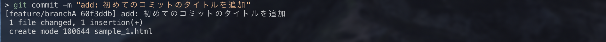
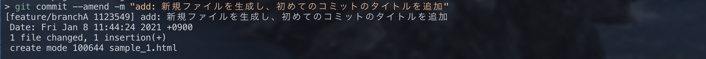
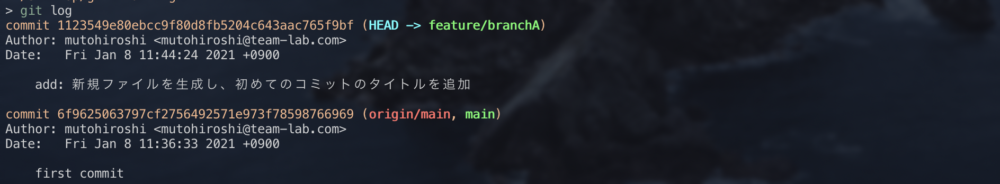

## `git commit --amend`

`git commit --amend`では、以下の2つを行う事ができます。

* 直前のコミットメッセージの修正
* コミット内容を後から追加

ただし、このコマンドを使うのは**pushする前のコミットを修正したい場合のみ**となります。

push後のコミットを修正してしまうと、ブランチのHEADのコミットがリモートとローカルの間で競合状態となってしまい解決がややこしくなるためです。

###【使い方】

①`sample_1.html`に文言を追加し、コミット

②直前のコミットメッセージを書き換えます

③`git log`でコミット履歴を確認すると、ログが書き換わっていることがわかります

