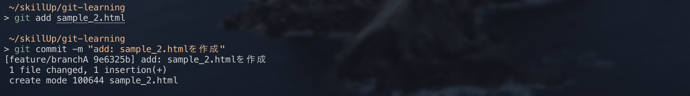
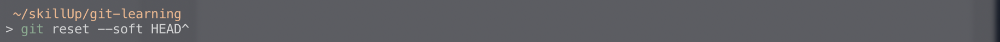
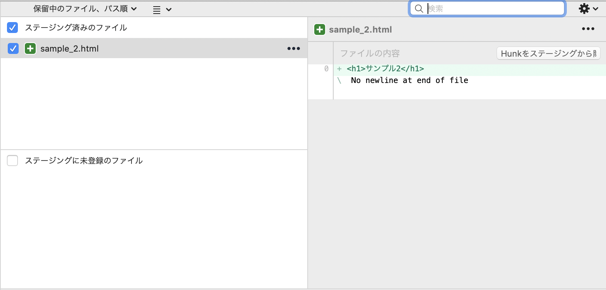
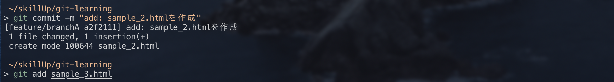
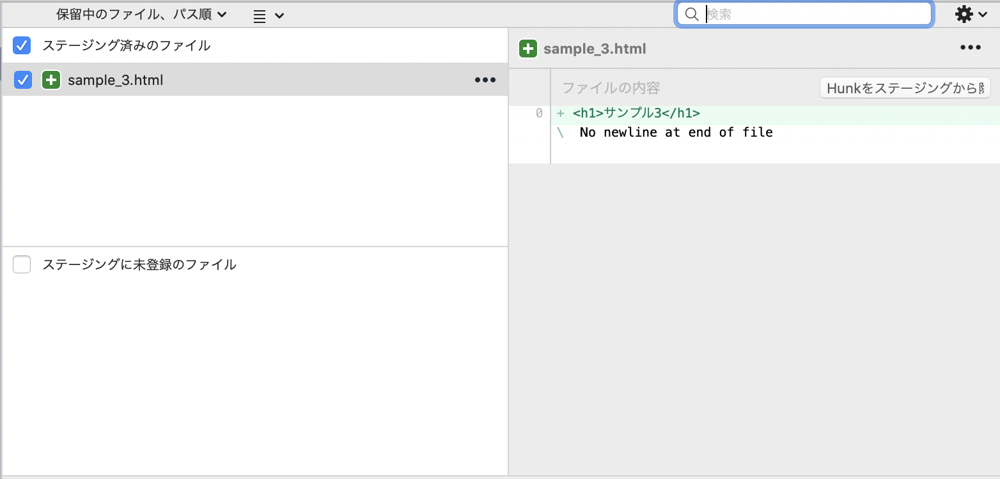
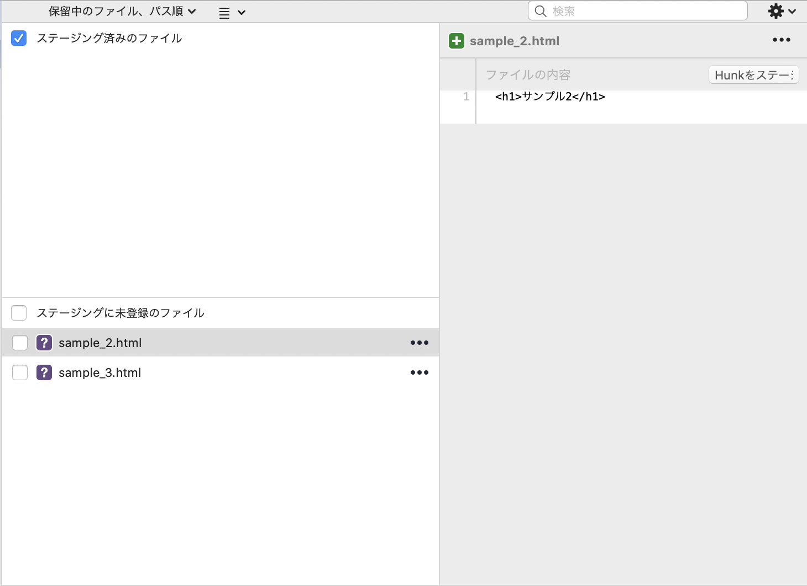
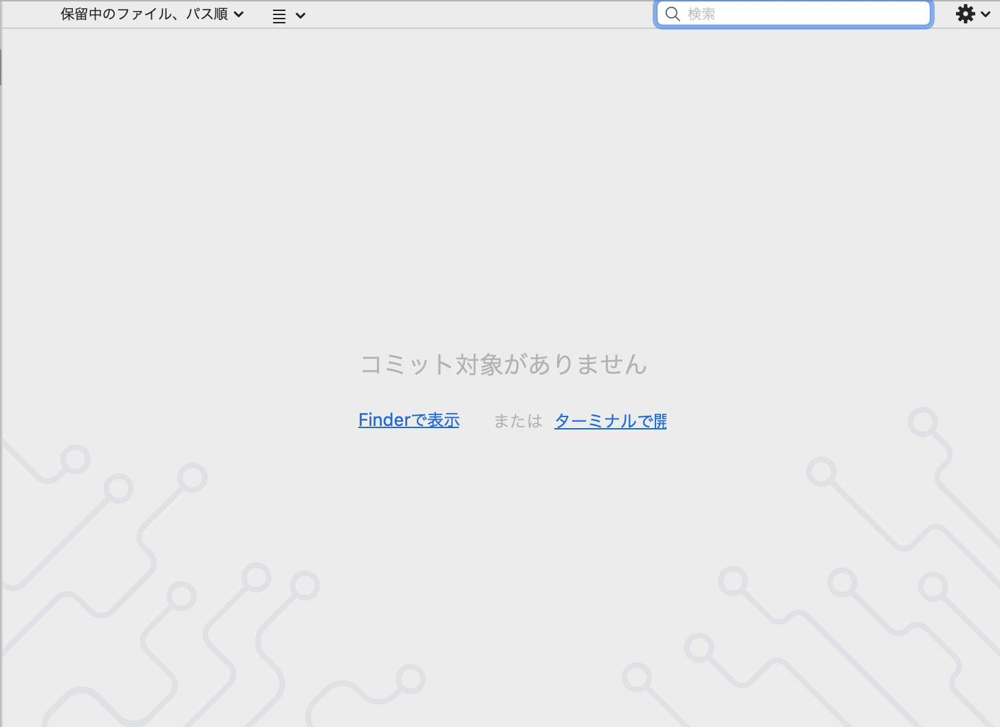

## `git reset`

`git reset`には3種類のオプションが存在します。

* `git reset --soft`

* `git reset --mixed`

* `git reset --hard`

それぞれ影響を与える範囲は、以下のようになっています。

--soft：HEADの位置のみ

--mixed：HEADの位置・ステージ

--hard：HEADの位置・ステージ・作業ディレクトリ

※ステージ=インデックスです。

### `--soft`

`--soft`は直前のcommitをやり直したときに便利です。

ローカルリポジトリにコミットしてしまったものを、ステージングエリアに戻します。

【使い方】

①`sample_2.html`を作成し、コミット

②他にも修正したい箇所があったため、`git reset --soft HEAD^`でステージングエリアに巻き戻す。

そうすると、ステージングエリアに変更した内容が戻っていることが確認できます。

### `--mixed`

`--mixed`は`git add`でステージしたファイルを作業ディレクトリに戻すときに使われます。これは、commitしたもの、`add`でステージしたものどちらもが巻き戻ります。

【使い方】

①
`sample_2.html`を作成し、コミット
`sample_3.html`を作成し、ステージに`git add`

②`git reset --mixed HEAD`でステージしたものを取り消す。
※尚、オプション無しでも`--mixed`を実行したときと同じ結果が得られます。

そうすると、作業ディレクトリにコミットしたものと、`git add`した内容が戻っていることが確認できます。

### `--hard`
`--hard`はステージングエリアにも作業ディレクトリにも残さず、コミットをまるごと消したいときに使われます。

【使い方】

①
`sample_2.html`を作成し、コミット
`sample_3.html`を作成し、ステージに`git add`

②`git reset --hard HEAD^`でステージしたもの、コミットしたものを取り消す。

そうすると、ステージにも作業ディレクトリにも、今回の作業の内容は残らなくなることが確認できます。
