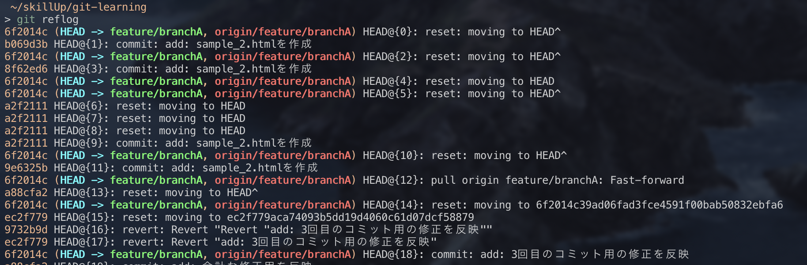

## `git reflog`

`git reflog`(リフログ)は、自分自身が行った操作履歴を確認できるコマンドです。

確認できるものとしては以下が含まれます。
* 新規コミット（コミット、マージ、プル、リバートなど）

* ブランチの切り替え（チェックアウト）

* 履歴の書き換え（リセット、リベースなど）

【使い方】

①`git reflog`で履歴を確認

②「resetの操作をする前（1つ前）に戻したい」といった場合、`git reset --hard HEAD@{0}`を実行で操作を元に戻すかことが可能です。