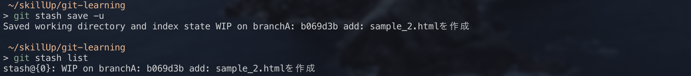
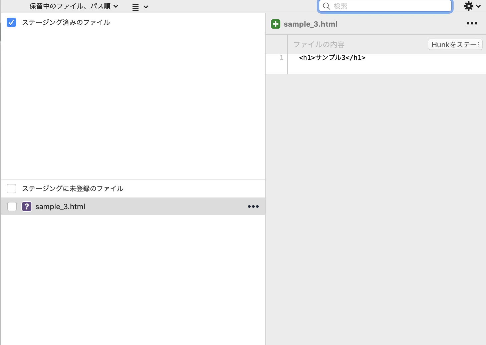
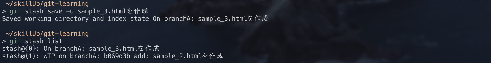
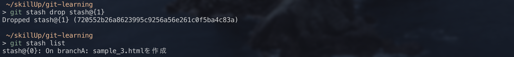

## `git stash`

`git stash`は編集中のファイルを一時的に保存したい場合に、便利なコマンドです。

【使い方】

①現在編集中のファイルを一時的に保存します。
`sample_3.html`を作成し、ステージに`git stash save -u`

`git stash save`で保存できますが、この場合untracked fileは保存できないため、untracked fileも一時保存したい場合は`git stash save -u`とします。

②`stash save`したものは、`git stash list`で確認できます。

※今回の場合、最後のコミットメッセージがコメントとして表示されています。

③一時退避させたものを復元したい場合は、`git stash apply stash@{番号}`
を実行します。番号は`git stash list`で確認できます。

最後のコミットメッセージがコメントとして表示されても、どのような変更を行っていたか分かりづらいため、独自にコメントをつけることが可能です。

その場合、`git stash save (-u) コメント`とします。

過去のstashが不要となった場合は、`git stash drop stash@{番号}`で削除することができます。

※全てのstashを削除したい場合は、`git stash clear`です。

