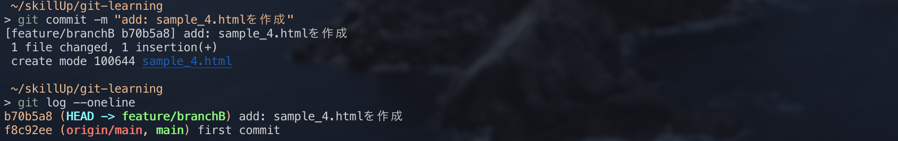
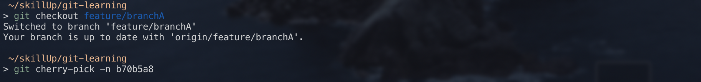
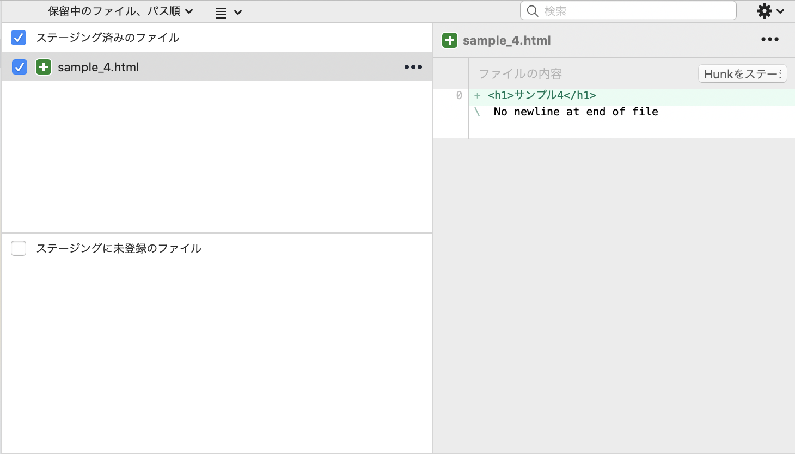
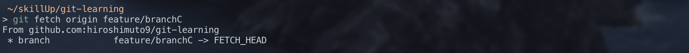
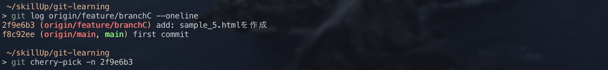
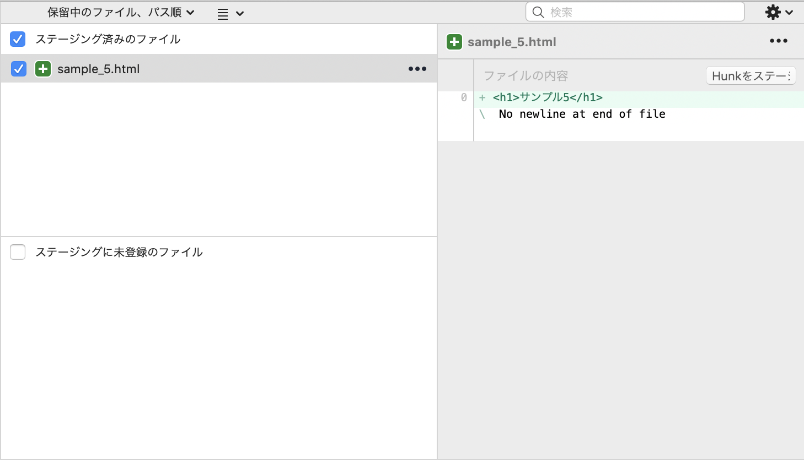

## `git cherry-pick`

`cherry-pick`は別ブランチから今作業中のブランチへ、必要なコミットだけをコピーできるコマンドです。

例えば、`feature/branchB`というブランチで**機能A**を実装しており、
ちょうど自分が作業中の`feature/branchA`でも**機能A**が必要となった時に、
`branchB`から**機能Aのコミットのみ**`branchA`にコピーすることができます。

【使い方(ローカル版)】

①`feature/branchB`のブランチを作成し、`sample_4.html`を作成・コミット。
`git log`でコミットIDを確認。

<div style="text-align: center;">

</div>

②`feature/branchA`のブランチに戻り、`git cherry-pick [コミットID]`で欲しいコミットを反映させる。

`git cherry-pick [コミットID]`では、取り込む際に自動でコミットします。
もし、コミットはしたくない場合は、`-n`オプションをつければコミットはされません。

<div style="text-align: center;">

</div>

<div style="text-align: center;">

</div>

【使い方(リモート版)】

ローカル版では、自分の別のローカルブランチからコミットを`cherry-pick`しましたが、チーム開発などでは**他人の作業ブランチから**コミットをコピーしたい場合なども出てくると思います。

その場合は、一度リモートブランチにpushしてもらい、自分のローカルにリモートブランチを取り込みます。

`git fetch <リモート名> <リモートブランチ名>`

今回は、`feature/branchC`をリモートに作成し、`sample_5.html`を作成・コミットしています。

<div style="text-align: center;">

</div>

以降の作業はローカル版と同じです。

<div style="text-align: center;">

</div>

<div style="text-align: center;">

</div>

【便利なオプション】

`git cherry-pick`の便利なオプションを紹介します。

* 複数のコミットを取り込みたい

`git cherry-pick {始点となるコミットの１つ前のコミットハッシュ}..{終点となるコミットハッシュ}`

※注意点

複数のコミットを取り込む際は、取り込みたいコミットの**1つ前のコミットハッシュ**を指定しないといけません。

例えば、

Commit1

Commit2

Commit3

Commit4

とあり、**Commit2~Commit4**を取り込みたい場合は、

`git cherry-pick {commit1}..{commit4}` となります。

* 複数のコミットを取り込む際、途中でコンフリクトが発生し、取り込みが止まってしまった場合

コンフリクトが発生した場合は、発生した時点以降の`cherry-pick`が行われません。

そのため、コンフリクトを解消した後に以下を実行することで再度`cherry-pick`が再開します。

```
git cherry-pick --continue
```

* コンフリクトが発生したファイルの修正を手動で行うのが大変な場合

**cherry-pick前の内容を優先したい場合**

```
git checkout --ours ファイル名
```

指定したファイルのコンフリクトが起きた箇所を、
cherry-pick前の内容に優先して書き換えてくれます。

**cherry-pick後の内容を優先したい場合**

```
git checkout --theirs ファイル名
```

指定したファイルでコンフリクトが起きた場所を、
cherry-pick後の内容に優先して書き換えてくれます。

しかし上記2つはどちらかの変更を優先して反映させるため、cherry-pick前後の内容をどちらも反映させたい場合は、手動で確認するほうが安全です。